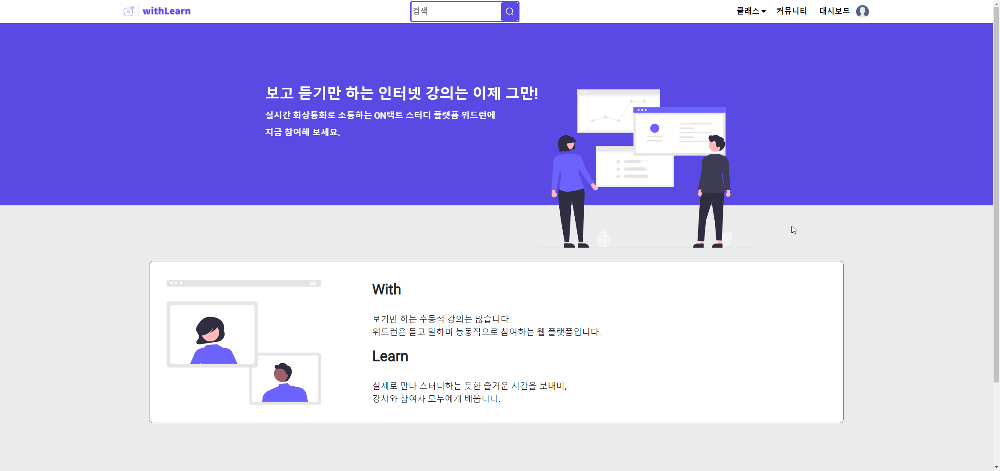
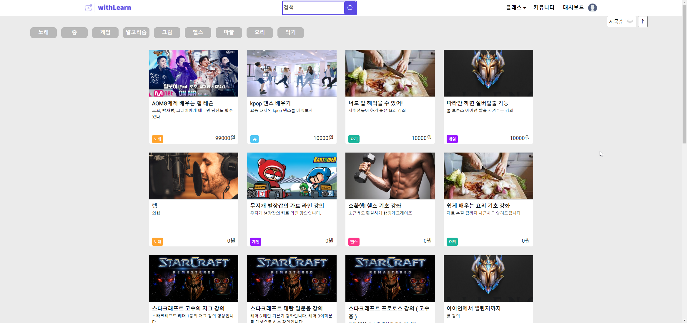
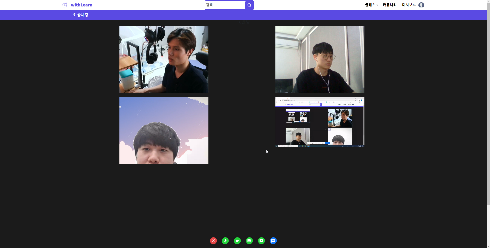
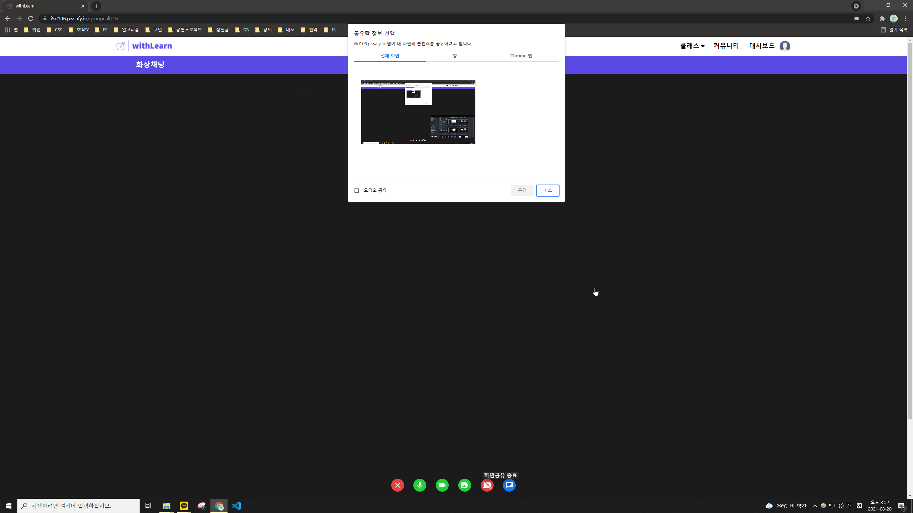
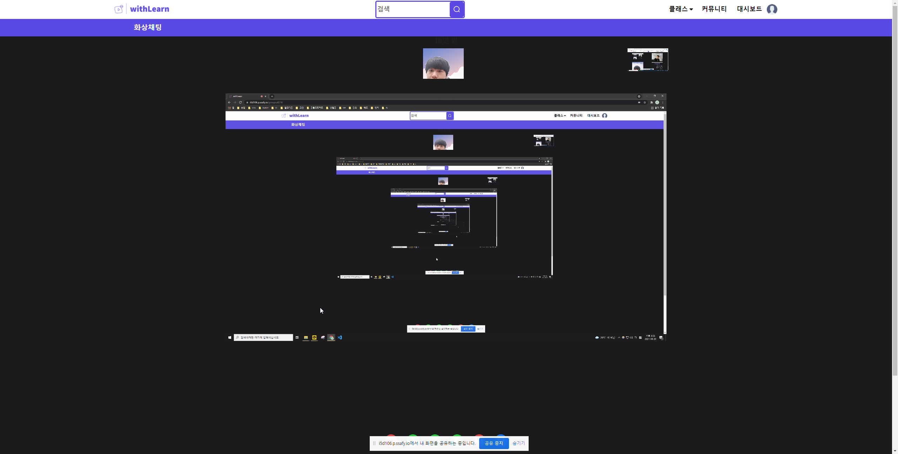
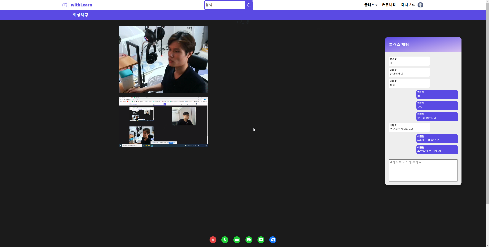
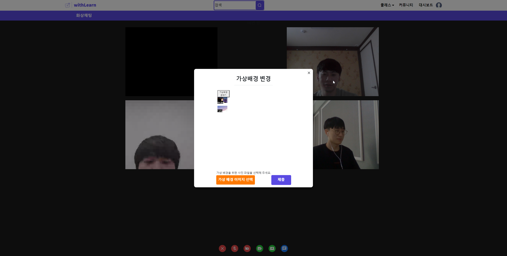
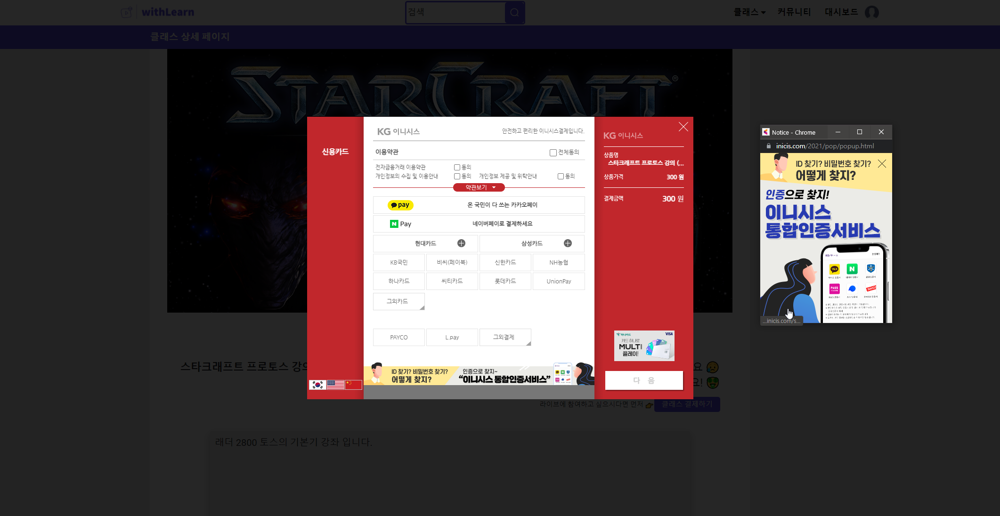
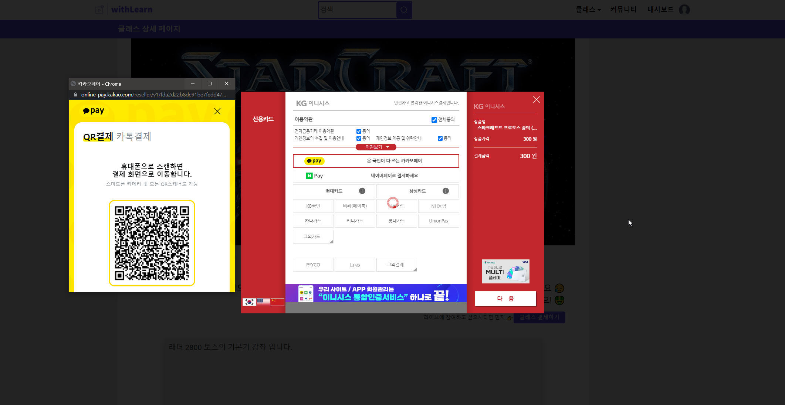
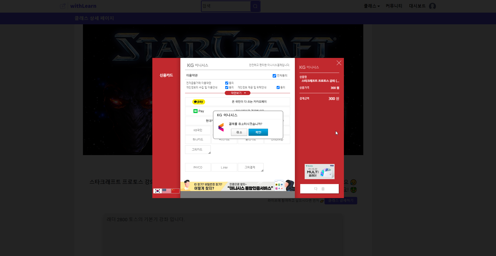

# withLearn

화상채팅 기반 양방향 소통 플랫폼

WebRTC, Kurento Media Server를 활용한 화상 채팅을 기반으로, 양방향으로 소통이 가능한 스터디 플랫폼입니다.

비대면 활동이 일상의 큰 부분으로 자리잡은 현재, 단방향으로만 하는 스터디에는 제한이 있습니다. 예를 들어 보컬, 악기, 춤 트레이닝이나 게임 강의 같은 종류들은 단순히 보기만 해서는 잘 늘지 않습니다. 학습자의 모습이 노출되고, 피드백을 받아야 효율적입니다.

이에 따라 일방적인 수강이 아닌, 소통하는 방식의 강의에 대한 수요가 있을 것이라고 생각했습니다. 이 흐름에 맞는 플랫폼을 구상해 보았습니다.

코로나로 인해 ON택트 만남이 주가 되면서 일상이 된 화상통화의 근간이 궁금했습니다. 직접 구현해 보고 싶어서 이를 활용한 서비스를 기획했습니다.

## Deploy

[https://j5d201.p.ssafy.io](https://j5d201.p.ssafy.io) (배포 종료)

## Requirements

- FE
    - Vue.js ^3.1.5
    - HTML
    - CSS
    - JavaScript (ES6)
- BE
    - Spring 2.4.5
    - java 1.8 openJDK
    - kurento (6.16.0)
- DevOps
    - AWS 20.0.4 LTS
    - Docker 20.10.7
    - nginx 1.18.0 (Ubuntu)
    - Jenkins 2.306
    - MySql 5.7

## Getting Started

- Web Socket 연결 후, 카메라와 음성의 사용을 위해서는 `HTTPS` 연결이 필수입니다.
  - 저는 Key를 발급받은 뒤 `Nginx`를 사용하여 `listen 443 ssl` port url로 리다이렉트 해 주었습니다.
- `AWS 환경설정` 폴더에 따라 배포 서버의 설정을 해 줍니다. Kurento, coturn은 필수로 설치합니다.
- Jenkins를 사용하여 배포합니다.

## Screen Shots

### Main

### Classes

### Groupcall

한 사람을 클릭하면 다른 사람의 `video`는 축소되고, 클릭한 `video`가 메인으로 나옵니다.

### Groupcall - 화면공유

### Groupcall - 채팅

### Groupcall - 크로마키

### Bootpay

